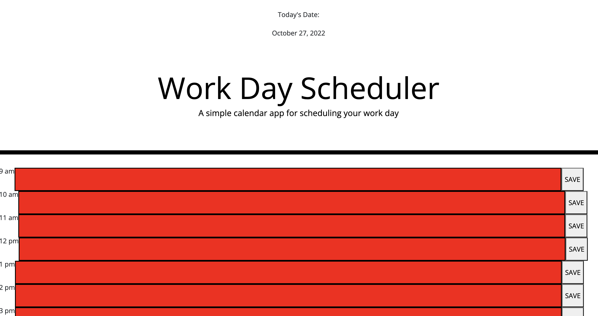

# Module 5 Challenge: Workday Scheduler  

## Description

This project was built to design a workday scheduler that keeps track of the 9am to 5pm workday. It allows for text to be inputted into each time slot, where it remains stored on the screen even when the page is refreshed so that information is never lost. This project was built so that the user may use this webpage to keep track of their workday. This project allowed me to apply the knowledge I’ve learned in class regarding Javascript, JQuery, and how I can utilize for loops in order to execute these time block functions. Throughout this project, I have learned the applications of JQuery and how it may help when accessing the HTML elements through Javascript.

## Usage

This webpage is used by entering desired text into the text area for each time block. Once text is inputted and once the save button is clicked, the text is saved and stored in the local storage so that the user may access this information whenever they reload the page.

## Deployed Application

The live page is found at https://sagirikenaga.github.io/ ___________

## Demo

The webpage appears as the following:

## Credits

Sagiri Ikenaga
